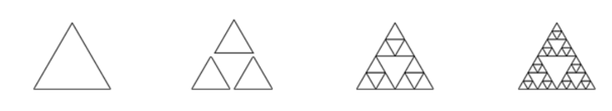
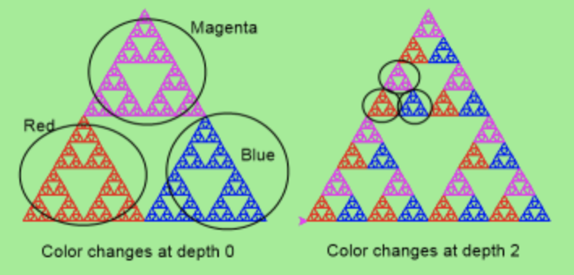

# Instructions  

The material for this lesson is based on [Chapter 18: Recursion](https://learnpythontherightway.com/chapter/chapter-18.html).

For this lesson, you will be required to complete the  exercises below. 

Make sure to write your solutions in the `main.py` file.

1. Modify the Koch fractal program so that it draws a Koch snowflake, like this:


2. 1. Draw a Cesaro torn line fractal, of the order given by the user. We show four different lines of orders 0,1,2,3. In this example, the angle of the tear is 10 degrees.


  ii. Four lines make a square. Use the code in part a) to draw cesaro squares. Varying the angle gives interesting effects — experiment a bit, or perhaps let the user input the angle of the tear.


  iii. (For the mathematically inclined). In the squares shown here, the higher-order drawings become a little larger. (Look at the bottom lines of each square - they’re not aligned.) This is because we just halved the drawn part of the line for each recursive subproblem. So we’ve “grown” the overall square by the width of the tear(s). Can you solve the geometry problem so that the total size of the subproblem case (including the tear) remains exactly the same size as the original?


3. A Sierpinski triangle of order 0 is an equilateral triangle. An order 1 triangle can be drawn by drawing 3 smaller triangles (shown slightly disconnected here, just to help our understanding). Higher-order 2 and 3 triangles are also shown. Draw Sierpinski triangles of any order input by the user.



4. Adapt the above program to change the color of its three sub-triangles at some depth of recursion. The illustration below shows two cases: on the left, the color is changed at depth 0 (the outmost level of recursion), and on the right, at depth 2. If the user supplies a negative depth, the color never changes. *(Hint: add a new optional parameter `colorChangeDepth` (which defaults to -1), and make this one smaller on each recursive sub-call. Then, in the section of code before you recurse, test whether the parameter is zero, and change the color.)*



5. Write a function, `recursive_min`, that returns the smallest value in a nested number list. Assume there are no empty lists or sublists:
```python
test(recursive_min([2, 9, [1, 13], 8, 6]) == 1)
test(recursive_min([2, [[100, 1], 90], [10, 13], 8, 6]) == 1)
test(recursive_min([2, [[13, -7], 90], [1, 100], 8, 6]) == -7)
test(recursive_min([[[-13, 7], 90], 2, [1, 100], 8, 6]) == -13)
```

6. Write a function `count` that returns the number of occurrences of target in a nested list:
```python
test(count(2, []), 0)
test(count(2, [2, 9, [2, 1, 13, 2], 8, [2, 6]]) == 4)
test(count(7, [[9, [7, 1, 13, 2], 8], [7, 6]]) == 2)
test(count(15, [[9, [7, 1, 13, 2], 8], [2, 6]]) == 0)
test(count(5, [[5, [5, [1, 5], 5], 5], [5, 6]]) == 6)
test(count("a", 
     [["this",["a",["thing","a"],"a"],"is"], ["a","easy"]]) == 4)
```

7. Write a function `flatten` that returns a simple list containing all the values in a nested list:
```python
test(flatten([2,9,[2,1,13,2],8,[2,6]]) == [2,9,2,1,13,2,8,2,6])
test(flatten([[9,[7,1,13,2],8],[7,6]]) == [9,7,1,13,2,8,7,6])
test(flatten([[9,[7,1,13,2],8],[2,6]]) == [9,7,1,13,2,8,2,6])
test(flatten([["this",["a",["thing"],"a"],"is"],["a","easy"]]) ==
              ["this","a","thing","a","is","a","easy"])
test(flatten([]) == [])
```

8. Rewrite the Fibonacci algorithm without using recursion. Can you find bigger terms of the sequence? Can you find `fib(200)`?


9. Use help to find out what `sys.getrecursionlimit()` and `sys.setrecursionlimit(n)` do. Create several experiments similar to what was done in infinite_recursion.py to test your understanding of how these module functions work.


10. Write a program that walks a directory structure (as in the last section of this chapter), but instead of printing filenames, it returns a list of all the full paths of files in the directory or the subdirectories. (Don’t include directories in this list — just files.) For example, the output list might have elements like this:
```python
["C:\Python31\Lib\site-packages\pygame\docs\ref\mask.html",
 "C:\Python31\Lib\site-packages\pygame\docs\ref\midi.html",
 "C:\Python31\Lib\site-packages\pygame\examples\aliens.py",
 "C:\Python31\Lib\site-packages\pygame\examples\data\boom.wav", 
 ... ]   
```

11. Write a program named `litter.py` that creates an empty file named `trash.txt` in each subdirectory of a directory tree given the root of the tree as an argument (or the current directory as a default). Now write a program named `cleanup.py` that removes all these files.

**Hint #1:** Use the program from the example in the last section of this chapter as a basis for these two recursive programs. Because you’re going to destroy files on your disks, you better get this right, or you risk losing files you care about. So excellent advice is that initially, you should fake the deletion of the files — just print the full path names of each file that you intend to delete. Once you’re happy that your logic is correct, and you can see that you’re not deleting the wrong things, you can replace the print statement with the real thing.

**Hint #2:** Look in the `os` module for a function that removes files.
