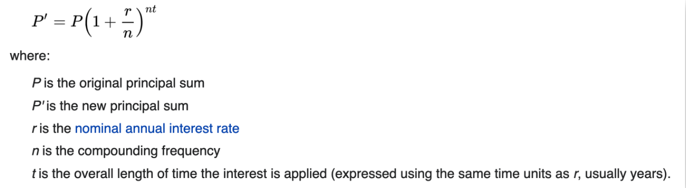

# Instructions  

The material for this lesson is based on [Chapter 2: Variables, expressions and statements](https://learnpythontherightway.com/chapter/chapter-2.html).

For this lesson, you will be required to complete the exercises below. 

Make sure to write your solutions in the `main.py` file.


1. Take the sentence: All work and no play makes Jack a dull boy. Store each word in a separate variable, then print out the sentence on one line using print.


2. Add parenthesis to the expression `6 * 1 - 2` to change its value from `4` to `-6`.


3. Place a comment before a line of code that you previously worked, and record what happens when you rerun the program.


4. Start the Python interpreter and enter `bruce + 4` at the prompt. This will give you an error:

```python
NameError: name 'bruce' is not defined
```

Assign a value to bruce so that `bruce + 4` evaluates to `10`.
  
5. The formula for computing the final amount if one is earning compound interest is given on Wikipedia as



Write a Python program that assigns the principal amount of $10000 to variable `P`, assigns to n the value `12`, and assigns to `r` the interest rate of 8%. Then have the program prompt the user for the number of years `t` that the money will be compounded for. 

Calculate and print the final amount after `t` years.

6. Evaluate the following numerical expressions in your head, then use the Python interpreter to check your results:

```python
>>> 5 % 2
>>> 9 % 5
>>> 15 % 12
>>> 12 % 15
>>> 6 % 6
>>> 0 % 7
>>> 7 % 0
```

What happened with the last example? Why? If you were able to correctly anticipate the computer’s response in all but the last one, it is time to move on. If not, take time now to make up examples of your own. Explore the modulus operator until you are confident you understand how it works.

7. You look at the clock and it is exactly 2pm. You set an alarm to go off in 51 hours. At what time does the alarm go off? _(Hint: you could count on your fingers, but this is not what we’re after. If you are tempted to count on your fingers, change the 51 to 5100.)_


8. Write a Python program to solve the general version of the above problem. Ask the user for the time now (in hours), and ask for the number of hours to wait. Your program should output what the time will be on the clock when the alarm goes off.
  
