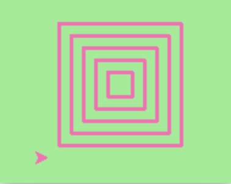

# Instructions  

The material for this lesson is based on [Chapter 4: Functions](https://learnpythontherightway.com/chapter/chapter-4.html).

For this lesson, you will be required to complete the exercises below. 

Make sure to write your solutions in the `main.py` file.

1. Write a void (non-fruitful) function to draw a square. Use it in a program to draw the image shown below. Assume each side is 20 units. (*Hint: notice that the turtle has already moved away from the ending point of the last square when the program ends.*)

2. Write a program to draw this. Assume the innermost square is 20 units per side, and each successive square is 20 units bigger, per side, than the one inside it.

3. Write a void function `draw_poly(t, n, sz)` which makes a turtle draw a regular polygon. When called with `draw_poly(tess, 8, 50)`, it will draw a shape like this:

4. The two spirals in this picture differ only by the turn angle. Draw both.

5. Write a void function `draw_equitriangle(t, sz)` which calls `draw_poly` from the previous question to have its turtle draw an equilateral triangle.

6. Write a fruitful function `sum_to(n)` that returns the sum of all integer numbers up to and including `n`. So `sum_to(10)` would be `1+2+3…+10` which would return the value `55`.

7. Write a function `area_of_circle(r)` which returns the area of a circle of radius `r`.

8. Write a void function to draw a star, where the length of each side is 100 units. _(Hint: You should turn the turtle by 144 degrees at each point.)_

## Bonus Question
9. Extend your program above. Draw five stars, but between each, pick up the pen, move forward by 350 units, turn right by 144, put the pen down, and draw the next star. You’ll get something like this:

What would it look like if you didn’t pick up the pen?
